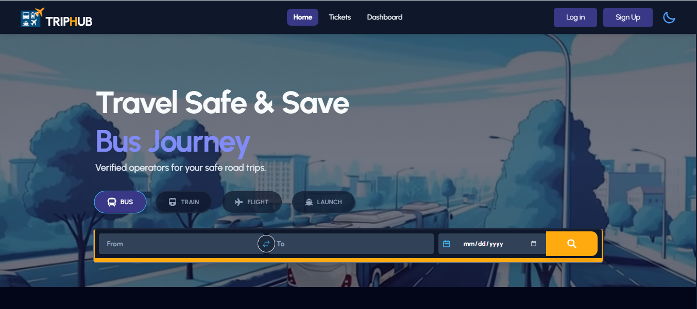

# 🎟️ TicketBari – MERN Stack Online Ticket Booking Platform

## 📌 Overview
TicketBari is a **full-stack MERN (MongoDB, Express.js, React, Node.js) web application** designed to streamline online ticket booking for multiple transport systems including Bus, Train, Launch, and Flights.

The platform implements **role-based access control (RBAC)** with three user roles — **User, Vendor, and Admin** — ensuring secure workflows, efficient data management, and scalable architecture.

---

## 🌐 Live Application
- 🔗 Frontend: https://trip-hub-12f28.web.app  
- 🔗 Backend API: https://trip-hub-server.vercel.app  

---

## 🧩 Core Functionalities

### 🔐 Authentication & Authorization
- Firebase Authentication (Email/Password + Google OAuth)
- JWT-based API protection
- Role-based route access (User / Vendor / Admin)
- Persistent login session (no logout on reload)
- Secure environment variable management

---

### 👤 User Module
- Browse and search tickets (From → To filtering)
- Filter by transport type and sort by price
- Book tickets with quantity validation
- Real-time booking status tracking:
  - Pending
  - Accepted
  - Rejected
  - Paid
- Stripe payment integration
- Transaction history dashboard

---

### 🧑‍💼 Vendor Module
- Create and manage ticket listings
- Upload images via imgbb API
- Update/delete tickets dynamically
- Handle booking requests (Accept / Reject)
- View performance metrics (Revenue, Sales)
- Data visualization using charts

---

### 🛡️ Admin Module
- Approve or reject vendor-submitted tickets
- Manage users and assign roles
- Detect and mark fraudulent vendors
- Control homepage advertisement (max 6 tickets)
- Monitor system activity and platform performance

---

## 📊 Data Visualization & Analytics
- Interactive dashboards using Recharts
- Vendor insights:
  - Total revenue
  - Tickets sold
  - Tickets added
- Real-time API-driven data updates

---

## 🔄 Booking Workflow
1. User submits booking request → Status: **Pending**  
2. Vendor reviews request:
   - Accept → Payment enabled  
   - Reject → Booking cancelled  
3. User completes payment via Stripe → Status: **Paid**  
4. Ticket quantity updates automatically in database  

---

## 💳 Payment Integration
- Stripe payment gateway implementation
- Dynamic price calculation (unit price × quantity)
- Secure transaction handling
- Payment history tracking

---

## 🛠️ Tech Stack

### Frontend
- React.js (Component-based architecture)
- React Router (Client-side routing)
- TanStack React Query (Server state management)
- Tailwind CSS + DaisyUI (UI design)
- Axios (HTTP client)
- Firebase Authentication
- React Hook Form (Form management)
- Recharts (Data visualization)

### Backend
- Node.js (Runtime environment)
- Express.js (REST API framework)
- MongoDB (NoSQL database)
- Firebase Admin SDK (Auth verification)
- Stripe API (Payments)
- dotenv (Environment config)
- CORS (Cross-origin handling)

---

## 📦 Key Dependencies
- react, react-router-dom
- @tanstack/react-query
- axios
- firebase
- recharts
- express
- mongodb
- stripe
- cors
- dotenv

---

## 🔐 Security Implementation
- Environment variable protection (.env)
- JWT token-based API security
- Firebase Admin token verification
- Protected routes (frontend + backend)
- CORS configuration for production

---

## ⚡ Performance & Optimization
- Pagination for scalable data loading
- Optimized API calls using React Query
- Lazy loading and efficient component rendering
- Error handling and loading states implemented

---

## 📱 Responsive Design
- Mobile-first approach
- Fully responsive across:
  - Mobile
  - Tablet
  - Desktop
- Consistent UI/UX design system

---

## 🚀 Local Development Setup

### Clone Client
```bash
git clone <CLIENT_REPO_URL>
cd client
npm install
npm run dev
```

### Clone Server
```bash
git clone <SERVER_REPO_URL>
cd server
npm install
node index.js
```

---

## 🔑 Environment Variables

Create a `.env` file:

```env
MONGODB_URI=your_mongodb_uri
STRIPE_SECRET_KEY=your_stripe_key
FIREBASE_API_KEY=your_firebase_key
IMGBB_API_KEY=your_imgbb_key
```

---

## ⚠️ Best Practices Followed
- Clean and modular code structure  
- Meaningful Git commit history  
- Secure API and authentication flow  
- No sensitive data exposure  
- Production-ready deployment  

---

## 📸 Project Preview


---

## 👨‍💻 Developer
**SM Mehedi Hasan Shawon**  
MERN Stack Developer  

---

## 🎯 Key Skills Demonstrated
- Full-Stack Web Development (MERN)
- REST API Design & Integration
- Authentication & Authorization (JWT, Firebase)
- Payment Gateway Integration (Stripe)
- State Management (React Query)
- Role-Based System Architecture
- Responsive UI Development
- Data Visualization & Dashboard Design
